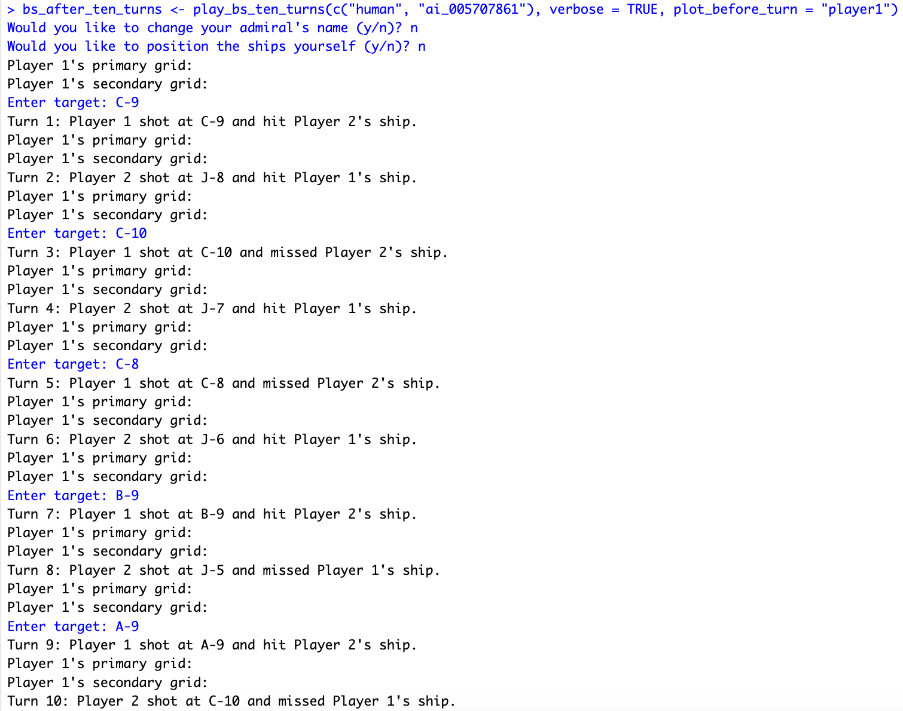

```{r setup, include=FALSE}
knitr::opts_chunk$set(echo = TRUE)
library(dplyr)
library(ggplot2)
```
### (1) Create several classes of objects.

\begin{itemize}
\item[\texttt{battleship}:] Essentially, this is the game object. Everything about the current status of the game is included here.
  \begin{itemize}
    \item[\texttt{fleets}] This is a length-two list of the players' fleets.
    \item[\texttt{history}] This is a tibble object with four columns:
    \begin{itemize}
      \item[from] A character vector of the admiral firing the shot.
      \item[to] A character vector of the admiral who is being fired upon.
      \item[target] A character vector of the target of the shot. e.g. "F-9", "B-6", etc.
      \item[hit] A logical vector of whether the shot hit a ship.
    \end{itemize}
  \end{itemize}

\item[\texttt{fleet}:] An object which represents one admiral's fleet.
\begin{itemize}
  \item[\texttt{admiral}] A character string representing the player in charge of the fleet.
  \item[\texttt{ocean}] A length-two numeric vector specifying the size and shape of the ocean the fleet occupies. Be aware that the first entry in ocean specifies the number of rows and the second entry specifies the number of columns. The Hasbro 2002 rules specify that the board is 10x10 squares with the rows labeled with capital letters A-J starting with A on top, and the columns labeled 1-10 with 1 on the left. This means that \texttt{ocean = c(5, 7)} specifies an ocean with 5 rows (lettered A-E) and 7 columns (lettered 1-7), with valid target squares going from "A-1", "A-2", "A-3", ..., "E-6", "E-7".
  \item[\texttt{ships}] A list of ship objects which are members of the fleet.
\end{itemize}

\item[\texttt{ship}:] An object representing one ship.
  \begin{itemize}
    \item[\texttt{name}] A character string. The name of the ship.
    \item[\texttt{size}] An integer. The number of spaces the ship occupies.
    \item[\texttt{position}] A length-two character vector of the bow (front) and stern (back) position of the ship, e.g., \texttt{position = c("A-1", "A-6")}. Positions are of the format "upper case letter-number" without any spaces.
    \item[\texttt{hits}] A length(ship\$size) logical vector indicating which portions of the ship have been hit.
    \item[\texttt{sunk}] Logical, indicating if the ship is sunk.
  \end{itemize}
\end{itemize}

### (2) Create functions:

#### Class Constructors:

\begin{itemize}
  \item[\texttt{ship()}] Creates one \texttt{ship} object
    \begin{itemize}
      \item[\texttt{name}] A character string, the name of the ship, e.g. "Battleship," "Submarine," etc.
      \item[\texttt{size}] An integer, the number of spaces the ship occupies.
    \end{itemize}
  \item[\texttt{fleet()}] Creates one \texttt{fleet} object.
    \begin{itemize}
      \item[\texttt{admiral}] A character string to represent the Admiral of the fleet.
      \item[\texttt{ocean}] \emph{Optional.} Default: \texttt{ocean = c(10, 10)} A length-two numeric vector representing the dimensions of the ocean the fleet will occupy. For the sake of this project you may assume ocean dimensions will be \emph{at least} \(5\times 5\) and \emph{at most} \(25\times 25\)
      \item[\texttt{ships}] \emph{Optional.} Default: \texttt{ships = NULL} A variable-length list object containing one or more \texttt{ship}-class objects.
    \end{itemize}
    If \texttt{ships = NULL}, the result of \texttt{default\_ships()} should be used.
  \item[\texttt{battleship()}] Creates a game object.
    \begin{itemize}
      \item[\texttt{fleets}] \emph{Optional.} Default: \texttt{fleets = list()}. A list of \texttt{fleet} objects in the game.
    \end{itemize}
    If \texttt{length(fleets) < 2} make either 1 or 2 default fleets (standard ships on a standard board). If a default \texttt{fleet} is generated the admiral should be "Player 1" or "Player 2" as appropriate.
\end{itemize}

```{r, error = TRUE}
# write class constructors here
# make sure you include working examples and test code for each
ship <- function(name, size) {
  if (!is.character(name) || length(name) != 1) {
    stop("Invalid name input. Name should be single character string.")
  }
  if (!is.numeric(size) || length(size) != 1 || size %% 1 != 0) {
    stop("Invalid size input. Size should be single integer value.")
  }
  structure(list(name = name, 
                 size = size,
                 position = character(2),
                 hits = rep(FALSE, size),
                 sunk = FALSE), 
            class = "ship")
}

default_ships <- function() {
  list(ship("Aircraft Carrier", 5), 
       ship("Battleship", 4), 
       ship("Destroyer", 3), 
       ship("Submarine", 3), 
       ship("Patrol Boat", 2))
}

fleet <- function(admiral, ocean = c(10, 10), ships = NULL) { 
  if (!is.numeric(ocean) || !all(ocean %% 1 == c(0, 0))) {
    stop("Invalid ocean input. Ocean should be vector of two integers.")
  }
  if (is.null(ships)) {
    ships <- default_ships()
  }
  if (!inherits(ships, "list") || !inherits(ships[[1]], "ship")) {
    stop("Invalid ships input. Ships should contain ship objects.")
  }
  structure(list(admiral = admiral, ocean = ocean, ships = ships), class = "fleet")
}

battleship <- function(fleets = list()) { 
  # MOVE OUTSIDE LATER
  library(dplyr)
  # MOVE OUTSIDE LATER
  if (length(fleets) < 2) {
    if (length(fleets) == 0) {
      fleets <- c(fleets, list(fleet("Player 1")))
    } # o.w. just create one more fleet
    fleets <- c(fleets, list(fleet("Player 2")))
  }
  history <- tibble(from = character(0), to = character(0), 
                    target = character(0), hit = logical(0))
  structure(list(fleets = fleets, history = history), class = "battleship")
}
```

```{r}
# test code
(test_ship <- ship("Test Ship", 2))
(test_fleet <- fleet("Test Admiral", ships = list(test_ship)))
(test_battleship <- battleship(list(test_fleet)))
```

#### Gameplay 

\begin{itemize}
  \item[\texttt{play\_bs()}] The workhorse function for playing a single game of Battleship. This function sets up the game and calls on each of the two players to make a move over and over again until there is a winner. It has the following arguments:
    \begin{itemize}
      \item[\texttt{players}] Who is playing the game, this should be the names of functions which return a target string like "E-6". The default should be for a one-player game \texttt{players = c("human", "ai\_123456789")}. The first player in \texttt{players} always goes first. 
      \item[\texttt{strengths}] The strength of the players. This is a character vector of length two, specifying the strength of the players. The default should be \texttt{strengths = c(9, 9)}. If the first player is human the first entry in strengths is unused.
      \item[\texttt{verbose}] logical. Should a turn counter, each player's actions and whether or not a ship was hit be printed out to the console.
      \item[\texttt{plot\_before\_turn}] Should the game be plotted before a player's turn. This a character of length 1, with default \texttt{plot = "none"} and options \texttt{"player 1", "player 2", "both"} stating whether the game should be plotted before a players turn. make sure you only plot information known to that player. This should be handed over to the \texttt{which} argument of your \texttt{plot.battleship()} function
    \end{itemize}
  The return value for this function is a list object. The minimal contents of this list should be \texttt{winner = } the name of the admiral who won the game. You may need to include more data in your return object to answer all of the questions in this project.
  
\item[\texttt{human()}] The function which polls a human player for a target. Use the \texttt{readline} function to get an input. It should accept a character string indicating a row (an appropriate letter) and a column (an appropriate number). Accepted responses should be in the form of "F-3", "J-10", etc. (\textbf{Hint:} The \texttt{substr()} or the \texttt{strsplit()} functions may be helpful for processing targets.) If a human inputs an unacceptable string like "A5", "5-5", etc. ask for another input with a warning; do not crash the entire game with an error message. Allow lower case letters as human input but convert them to uppercase letters before returning, e.g., the input "f-2" should be returned as "F-3".

\item[\texttt{ai\_123456789()}] This is your bot, make sure you change its name to \texttt{ai\_yourStudentIdNumber()}. It should take \emph{either} the following three arguments:
  \begin{itemize}
      \item[\texttt{battleship}] The current game object. \textbf{Note:} Though your bot has access to the \emph{entire} game object which notably includes your opponent's ship placements, you are to limit your bot's access to the following items:
      \begin{itemize}
        \item[\texttt{history}] The object detailing the shots and hits in the game.
        \item[\texttt{ocean}] The objects detailing the size and shape of your opponents \texttt{ocean}, so you know the bounds of the regions you need to look for ships in.
        \item[\texttt{size}] The vector of ship sizes so you know how many ships of each size you are looking for.
      \end{itemize}
      Any bots which are found to access the opponent's ship placements or status (\texttt{position}, \texttt{hits}, or \texttt{sunk})  will be excluded from the tournament section and receive a \(0\) for that portion as well as a \(0\) for all portions of this project involving the AI agent you were to write. \textbf{DON'T BE A CHEATER!}
      \item[\texttt{strength}] \emph{Optional.} Default: \texttt{strength = 9}. This should be the level of play of your bot. The default should be \texttt{strength = 9}, this is the best bot you have made at the time of your submission. You should also have a \texttt{strength = 0} bot which plays completely randomly, with no strategy, but never in the same spot twice. It \textbf{is not necessary} to have more than these two levels, but it is required to have at least these two. You may want to explore and experiment with different strength bots for a variety of reasons, but you are not required to.
      \item[\texttt{memory}] \emph{Optional.} Default: \texttt{memory = list()}. This is an argument that allows you to store any information, computed quantities, etc. from one turn to the next. This can help make your code run a lot neater, faster, and more efficiently. This function will return a memory as well as a target location. This memory is fed back to your bot through the memory argument in it's next turn. This can help you write overarching multi-turn strategies without recomputing them in every turn.

No bot shall ever fire upon the same spot twice nor shall any bot fire on a spot outside the confines of the designated ocean.
      
The return value of this function should be a list of length two, with the first entry being a character string named \texttt{target} representing a target square in the opponent's ocean grid like "D-6", "I-7", etc., and the second entry is a list named \texttt{memory}. This memory will be handed over to your AI in it's next turn.

Make sure that this function is entirely self-contained. It cannot access any functions or objects outside of itself. It knows and can use only what is handed over to it in its three arguments.
\end{itemize}
\end{itemize}

\emph{or} the function should take one argument:
  \begin{itemize}
      \item[\texttt{fleet}] \emph{Optional.} No default. If a \texttt{fleet} object is passed to your AI function it should return the same \texttt{fleet} object with updated \texttt{position} values for the \texttt{ship} objects in the fleet. That is, it places the ships.
\end{itemize}

\begin{itemize}
\item[\texttt{default\_ships()}] Create a list object containing the five default ships (see rules), with no assigned positions.

\item[\texttt{position\_fleet()}] A function to assign ships a position in the ocean.
  \begin{itemize}
    \item[\texttt{fleet}] A fleet object.
    \item[\texttt{positions}] \emph{Optional.} Default: \texttt{positions = NULL}. A list of the same length as the ship list for the \texttt{fleet}. Each list item shall comprise a length two character vector indicating the start and end position of each ship in the ship list.
  \end{itemize}
  If no \texttt{positions} list is provided, the ships shall be randomly placed in the ocean.
  The return value for this function should be a fleet object with updated ship positions.
\end{itemize}
```{r}
play_bs <- function(players = c("human", "ai_005707861"), strengths = c(9, 9), 
                    verbose = FALSE, plot_before_turn = "none", 
                    oceans = list(c(10, 10), c(10,10)), 
                    fleet_size = list(default_ships(), default_ships())) { 
  
  first_fleet = fleet(admiral = players[1], ocean = oceans[[1]], ships = fleet_size[[1]]) 
  second_fleet = fleet(admiral = players[2], ocean = oceans[[2]], ships = fleet_size[[2]]) 
  
  game <- battleship(list(first_fleet, second_fleet)) 
  
  if (players[1] == "human") {
    while (TRUE) {
      choice <- readline("Would you like to change your admiral's name (y/n)? ")
      if (choice == 'y') {
        new_name <- readline("What would you like your admiral name to be? ")
        game$fleets[[1]]$admiral <- new_name
        break
      } else if (choice == 'n') {
        break
      } else {
        message("Invalid answer. Please enter 'y' for yes and 'n' for no.")
      }
    }
  } 
  
  # helper function
  get_positions_from_user <- function() {
    positions <- character(2)
    ready <- logical(2)
    while (!all(ready)) {
      ready <- logical(2)
      positions <- character(2)
      
      input <-
        readline(
          "Please enter the starting and ending positions in the form 'start,end' (e.g., 'f-3,f-5'): "
        )
      
      if (!grepl(",", input) ||
          grepl(" ", input) || length(strsplit(input, ",")[[1]]) != 2) {
        message("Invalid input format. Please separate positions with a comma and no spaces.")
      } else {
        input <- strsplit(input, ",")[[1]] # i.e. "f-3" "f-5"
        for (i in seq_along(input)) {
          target <- strsplit(input[i], "-")[[1]]
          if (length(target) != 2 ||
              !is.character(target[1]) ||
              !(toupper(target[1]) %in% LETTERS) ||
              !is.numeric(suppressWarnings(as.numeric(target[2]))) ||
              suppressWarnings(as.numeric(target[2])) %% 1 != 0) {
            message("Invalid input format. Please separate rows and columns using '-'.")
            break
          } else {
            positions[i] <- input[i]
            ready[i] <- TRUE
          }
        }
      }
    }
    positions
  }
  
  used_coords <- list()
  # position fleets
  i <- 1
  if (players[i] == "human") {
    while (i <= 1) {
      choice <-
        readline(prompt = "Would you like to position the ships yourself (y/n)? ")
      if (tolower(choice) == "y") {
        used_coords[[i]] <- list() # keep track of coordinates ship takes up
        break_for_loop <- FALSE
        break_while_loop <- FALSE
        for (k in seq_len(length(game$fleets[[i]]$ships))) {
          # break_for_loop corresponds to this loop
          ship <- game$fleets[[i]]$ships[[k]]
          cat(
            "Where would you like to place",
            paste0(ship$name, "?"),
            "Here is the ship's information.\n"
          )
          print(ship)
          
          ready <-
            logical(3) # first 2 out of bounds check, third is expandable check (i.e. no diagonal placements allowed)
          while (!all(ready)) {
            # break_while_loop corresponds to this loop
            ready <- logical(3)
            positions <- get_positions_from_user()
            while (positions[1] == positions[2]) {
              message("Positions cannot be identical.")
              positions <- get_positions_from_user()
            }
            # check out of bounds and expandable
            available_rows <- LETTERS[1:game$fleets[[i]]$ocean[1]]
            available_cols <- 1:game$fleets[[i]]$ocean[2]
            for (j in seq_along(positions)) {
              pos <- positions[j]
              if (!(strsplit(pos, "-")[[1]][1] %in% available_rows) ||
                  !(strsplit(pos, "-")[[1]][2] %in% available_cols)) {
                message(
                  "Invalid positions. Make sure requested row and column coordinates are not out of bounds."
                )
                break
              } else {
                ready[j] <- TRUE
              }
            }
            coords <- expand_position(positions)
            if (is.null(coords)) {
              message(
                "Invalid positions. The ships can only be placed horizontally or vertically, not diagonally."
              )
            } else {
              if (length(coords) != ship$size) {
                message("Invalid positions. The positions must be the same size of the ship apart.")
              } else if (any(coords %in% unlist(used_coords[[i]]))) {
                message("Invalid positions. There is overlap between your ship and another ship.")
                while (TRUE) {
                  choice <-
                    readline("Would you like to restart the ship placement process (y/n)? ")
                  if (choice == "y") {
                    i <- i - 1
                    break_while_loop <- TRUE
                    break_for_loop <- TRUE
                    break
                  } else if (choice == "n") {
                    break
                  } else {
                    message("Invalid answer. Please enter 'y' for yes and 'n' for no.")
                  }
                }
              } else {
                used_coords[[i]] <- c(used_coords[[i]], list(coords))
                game$fleets[[i]]$ships[[k]]$position <- positions
                ready[3] <- TRUE
              }
            }
            if (break_while_loop) {
              break
            }
          }
          if (break_for_loop) {
            break
          }
        }
      } else if (tolower(choice) == 'n') {
        game$fleets[[i]] <- position_fleet(game$fleets[[i]])
        used_coords[[i]] <- lapply(game$fleets[[i]]$ships, function(ship) {
          expand_position(ship$position)
        })
      } else {
        # invalid input
        message("Invalid answer. Please enter 'y' for yes and 'n' for no.")
        i <- i - 1
      }
      i <- i + 1
    } 
  } else { # for ai just generate positions
    game$fleets[[1]] <- ai_005707861(game$fleets[[1]]) # this positions fleet
    used_coords[[1]] <- lapply(game$fleets[[1]]$ships, function(ship) {
      expand_position(ship$position)
      })
  }
  
  game$fleets[[2]] <- ai_005707861(game$fleets[[2]])
  used_coords[[2]] <- lapply(game$fleets[[2]]$ships, function(ship) {
    expand_position(ship$position)
  })

  # game play starts here
  turn <- 1
  memory <- list() # first comp for player1, second for player2
  
  while (TRUE) {
    current_player <- ifelse(turn %% 2, 1, 2)
    opponent_player <- ifelse(turn %% 2, 2, 1)
    current_admiral <- game$fleets[[current_player]]$admiral # name
    opponent_admiral <- game$fleets[[opponent_player]]$admiral
    
    if (plot_before_turn %in% c("both", "player1", "player2")) {
      plot(game, which = plot_before_turn)
    }
    
    if (players[current_player] != "human") {
      if (length(memory) <= 1) { # size arg not used
        result <- ai_005707861(game, game$history, game$fleets[[opponent_player]]$ocean, numeric(0),
                                                 strengths[current_player])
      } else {
        result <- ai_005707861(game, game$history, game$fleets[[opponent_player]]$ocean, numeric(0),
                                                 strengths[current_player], memory[[current_player]])
      }
      memory[[current_player]] <- result$memory
      target <- result$target
    } else {
      target <- human()
    }
    
    # check that target is valid (not out of bounds and not used before)
    if (players[current_player] == "human") {
      available_rows <- LETTERS[1:game$fleets[[opponent_player]]$ocean[1]]
      available_cols <- 1:game$fleets[[opponent_player]]$ocean[2]
      while (TRUE) {
        if (!(strsplit(target, "-")[[1]][1] %in% available_rows) ||
            !(strsplit(target, "-")[[1]][2] %in% available_cols)) {
          message("Requested target out of bounds. Please enter a valid target.")
          target <- human()
        } else {
          tgt <- target
          already_used <- game$history %>%
            filter(from == "human", target == tgt) %>%
            summarise(count = n()) %>%
            pull(count) > 0
          if (already_used) {
            hit <-
              game$history %>% filter(from == "human", target == target) %>% pull(hit)
            message(paste0(
              "You already shot at the requested target and ",
              ifelse(hit, "hit a ship", "missed"),
              "."
            ))
            target <- human()
          } else {
            break
          }
        }
      }
    }
    
    # target valid, update history 
    hit <- FALSE
    for (i in seq_along(used_coords[[opponent_player]])) {
      if (target %in% used_coords[[opponent_player]][[i]]) {
        game$fleets[[opponent_player]]$ships[[i]]$hits[used_coords[[opponent_player]][[i]] %in% target] <- TRUE
        hit <- TRUE
        if (all(game$fleets[[opponent_player]]$ships[[i]]$hits)) { # also update sunk if applicable
          game$fleets[[opponent_player]]$ships[[i]]$sunk <- TRUE 
        }
      }
    }
    
    game$history <- tibble(add_row(
      data.frame(game$history),
      from = players[current_player],
      to = players[opponent_player],
      target = target,
      hit = hit
    ))
    
    if (verbose) {
      cat("Turn", paste0(turn, ":"), current_admiral, "shot at", target, "and", 
          ifelse(hit, "hit", "missed"), paste0(opponent_admiral, "'s"), "ship.\n")
    }
    
    if (all(sapply(game$fleets[[opponent_player]]$ships, function(ship)
      ship$sunk))) {
      if (verbose) {
        cat(
          current_admiral,
          "has sunk all of",
          paste0(opponent_admiral, "'s"),
          "ships and won the game!"
        )
      }
      output <- list(winner = current_admiral, game = game)
      break
    }
    
    turn <- turn + 1
  }
  output
}

ai_005707861 = function(x, ...) {
  UseMethod("ai_005707861")
}

ai_005707861.battleship <- function(x, history, ocean, size, strength = 9, memory = list()) { 
  
  # result <- ai_005707861(game, game$history, game$fleets[[opponent_player]]$ocean,
  #                                                strengths[current_player], memory[[current_player]])

  possible_targets <- expand.grid(row = LETTERS[1:ocean[1]],
                                  col = 1:ocean[2])
  possible_targets <- with(possible_targets, paste(row, col, sep = "-"))
  
  history <- x$history %>%
    filter((nrow(x$history) %% 2 == 0 & row_number() %% 2 == 1) |
           (nrow(x$history) %% 2 == 1 & row_number() %% 2 == 0))
  
  if (nrow(history) > 0 && history$hit[nrow(history)]) {
    memory$mode <- "attack"
    memory$last_hit <- history$target[nrow(history)]
    if (!is.null(memory$tried_directions) && length(memory$tried_directions) != 0) {
      memory$successful_direction <- memory$tried_directions[length(memory$tried_directions)]
    } else {
      memory$tried_directions <- character(0)
    }
  }

  # remove previously targeted cells
  previous_targets <- history$target
  possible_targets <- possible_targets[!(possible_targets %in% previous_targets)]
  
  # helper function
  get_target_in_direction <- function(last_hit, direction) {
    row <- substr(last_hit, 1, 1)
    col <- as.numeric(substr(last_hit, 3, nchar(last_hit)))
    if (direction == "up") {
      row <- LETTERS[match(row, LETTERS) - 1]
    } else if (direction == "down") {
      row <- LETTERS[match(row, LETTERS) + 1]
    } else if (direction == "left") {
      col <- col - 1
    } else if (direction == "right") {
      col <- col + 1
    }
    paste(row, col, sep = "-")
  }
  
  if (is.null(memory$mode) || memory$mode == "search" || strength == 0) {
    # search mode: randomly choose a target
    target <- sample(possible_targets, 1)
    memory <- list(mode = "search", last_hit = target, tried_directions = character(0))
  } else {
    # attack mode
    if (!is.null(memory$successful_direction)) {
      # continue attacking in the successful direction
      target <- get_target_in_direction(memory$last_hit, memory$successful_direction)
      if (target %in% previous_targets || !(target %in% possible_targets)) {
        # if target already hit or out of bounds, switch back to search mode
        memory$successful_direction <- NULL
        target <- sample(possible_targets, 1)
        memory <- list(mode = "search", last_hit = target, tried_directions = character(0))
      }
    } else {
      # try attacking in different directions until successful
      last_hit <- memory$last_hit
      tried_directions <- memory$tried_directions
      directions <- c("up", "down", "left", "right")
      directions <- setdiff(directions, tried_directions)
      
      # eliminate out of bounds cases
      if (match(substr(last_hit, 1, 1), LETTERS) == 1)
        directions <- directions[directions != "up"]
      if (match(substr(last_hit, 1, 1), LETTERS) == ocean[1])
        directions <- directions[directions != "down"]
      if (as.numeric(substr(last_hit, 3, nchar(last_hit))) == 1)
        directions <- directions[directions != "left"]
      if (as.numeric(substr(last_hit, 3, nchar(last_hit))) == ocean[2])
        directions <- directions[directions != "right"]
      
      if (length(directions) == 0) {
        # if all directions have been tried, switch back to search mode
        target <- sample(possible_targets, 1)
        memory <- list(mode = "search", last_hit = target, tried_directions = character(0))
      } else {
        direction <- sample(directions, 1)
        target <- get_target_in_direction(last_hit, direction)
        if (target %in% previous_targets || !(target %in% possible_targets)) {
          # if target already hit or out of bounds, switch back to search mode
          target <- sample(possible_targets, 1)
          memory <- list(mode = "search", last_hit = target, tried_directions = character(0))
        }
        memory$tried_directions <- c(memory$tried_directions, direction)
      }
    }
  }
  list(target = target, memory = memory)
}

ai_005707861.fleet = function(x, ...) {
  position_fleet(x)
}


# there should be ai.battleship, ai.fleet(fleet = NULL) (battleship - which to shoot at, memory; fleet - place ships)

# note for grader: message() used instead of warning() because warning() does not appear in console until after the user 
# enters valid target
human <- function() { 
  while (TRUE) {
    target <- readline(prompt = "Enter target: ")
    target <- strsplit(target, "-")[[1]]
    if (length(target) != 2 || !is.character(target[1]) || !(toupper(target[1]) %in% LETTERS)
        || !(target[2] %in% as.character(1:100)) || as.numeric(target[2]) %% 1 != 0) {
      message("In human() : \n  Invalid target format. Please enter in the form 'letter-number' (e.g., 'f-3' or 'J-10').")
    } else {
      break
    }
  }
  paste0(target, collapse = "-")
}

# default_ships() was instantiated in code chunk in Part 2

# helper functions
pos_to_label <- function(row, col) {
  letter <- LETTERS[row]
  paste0(letter, "-", col)
}

generate_coords <- function(size, ocean) {
  # coord elements are vectors of length ship$size, not just front and back
  coords <- list()
  # generate horizontal
  for (i in seq_len(ocean[1])) {
    # iterate thru all rows
    for (j in seq_len(ocean[2] - size + 1)) {
      # iterate thru all possible cols
      coords <-
        c(coords, list(sapply(j:(j + size - 1), function(col) {
          pos_to_label(i, col)
        })))
    }
  }
  # generate vertical
  for (j in seq_len(ocean[2])) {
    for (i in seq_len(ocean[1] - size + 1)) {
      coords <- c(coords, list(sapply(i:(i + size - 1), function(row) {
        pos_to_label(row, j)
      })))
    }
  }
  coords
}

expand_position <- function(position) { # returns set of coords, assumes position is valid format
  # also checks if the positions are even possible
  bow <- position[1]
  stern <- position[2]
  coords <- character(0)
  # horizontal case - i.e. f-4, f-8
  if (strsplit(bow, "-")[[1]][1] == strsplit(stern, "-")[[1]][1]) {
    # swap bow and stern if necessary so it's left-right
    if (as.numeric(strsplit(bow, "-")[[1]][2]) > as.numeric(strsplit(stern, "-")[[1]][2])) {
      old_bow <- bow
      bow <- stern
      stern <- old_bow
    }
    row <- strsplit(bow, "-")[[1]][1]
    for (j in 0:(as.numeric(strsplit(stern, "-")[[1]][2]) - as.numeric(strsplit(bow, "-")[[1]][2]))) {
      col <- as.numeric(strsplit(bow, "-")[[1]][2]) + j
      coords <- c(coords, paste0(row, "-", col))
    }
  } else if (strsplit(bow, "-")[[1]][2] == strsplit(stern, "-")[[1]][2]) {
    # vertical case - i.e. d-10, h-10
    # swap bow and stern if necessary so it's top-down
    if (strsplit(bow, "-")[[1]][1] > strsplit(stern, "-")[[1]][1]) {
      old_bow <- bow
      bow <- stern
      stern <- old_bow
    }
    col <- as.numeric(strsplit(bow, "-")[[1]][2])
    for (i in 0:(grep(strsplit(stern, "-")[[1]][1], LETTERS) - grep(strsplit(bow, "-")[[1]][1], LETTERS))) {
      row <- LETTERS[which(LETTERS %in% strsplit(bow, "-")[[1]][1]) + i]
      coords <- c(coords, paste0(row, "-", col))
    }
  } else {
    coords <- NULL
  }
  coords
}

position_fleet <- function(fleet, positions = NULL) {
  if (is.null(positions)) {
    ocean <- fleet$ocean
    while(TRUE) {
      positions <- list()
      used_coords <- character(0)
      for (s in fleet$ships) {
        not_placeable <- FALSE # to account for cases where not all ships are successfully placed
        size <- s$size
        coord_candidates <- generate_coords(size, ocean)
        
        while (TRUE) {
          chosen_coords_index <- sample(1:length(coord_candidates), 1)
          chosen_coords <- coord_candidates[[chosen_coords_index]]
          if (!any(chosen_coords %in% used_coords)) { # ship is placeable
            used_coords <- c(used_coords, chosen_coords)
            positions <- c(positions, list(c(chosen_coords[1], chosen_coords[size])))
            break
          } else { # update coord_candidates to remove unusable set of coords
            coord_candidates[[chosen_coords_index]] <- NULL
            if (length(coord_candidates) == 0) {
              not_placeable <- TRUE # allows to subsequently break out of for loop
              break # break out of while loop
            }
          }
        }
        if (not_placeable) {
          break
        }
      }
      if (length(positions) == length(fleet$ships)) { # good to go, if not then continue in while loop
        break
      }
    }
    
  }
  for (i in seq_along(fleet$ships)) {
    fleet$ships[[i]]$position <- positions[[i]]
  }
  fleet
}
```

```{r}
# test code
play_bs(players = c("ai_005707861", "ai_005707861"), verbose = TRUE)
(test_fleet <- ai_005707861(test_fleet)) # randomly position test ship using position_fleet()
```


### (3) Create methods
For the following functions create methods for the specified classes. Unless specified, you are free to implement these however you like, but you should think carefully about what makes sense to do, that is, for example, what should printing a \texttt{ship} entail? Or a \texttt{fleet}? How would you summarize a game (a \texttt{battleship} object)?

\begin{itemize}
\item{\texttt{print()}}
  \begin{itemize}
    \item[\texttt{ship}] Print a meaningful representation of a \texttt{ship} object, something other than simply dumping the contents with the default printing method.
    \item[\texttt{fleet}] Print a meaningful representation of a \texttt{fleet} object, something other than simply dumping the contents with the default printing method.
    \item[\texttt{battleship}]Print a meaningful representation of a \texttt{battleship} object, something other than simply dumping the contents with the default printing method.
  \end{itemize}

\item{\texttt{plot()}}
  \begin{itemize}
    \item[\texttt{fleet}] This should produce a graphical representation of one player's game board, with their ships placed appropriately, including indications where the ship has been hit.
    \item[\texttt{battleship}] This should produce a graphical representation of the current state of the game. It has an additional argument \item[\texttt{which}] stating whose information should be plotted. This a character of length 1, with default \texttt{plot = "both"} and options \texttt{"player 1", "player 2"} stating whether only information known to that player should be plotted.
    It should show all the oceans for the respective players, along with representations of all misses and hits on each ocean, but should only show the requested player's ships on the active player's ocean.
    The plot function should take an optional argument \texttt{player}, showing only the ships of the specified player. If \texttt{player = 0} (the default) the ships for all players should be shown.
  \end{itemize}

\item{\texttt{summary()}}
  \begin{itemize}
    \item[\texttt{fleet}] Summarize a \texttt{fleet} object in some meaningful way.
    \item[\texttt{battleship}] Summarize a \texttt{battleship} object in some meaningful way.
  \end{itemize}
\end{itemize}

```{r}
# write your methods here
# make sure you include working examples and test code for each

# print functions
print.ship <- function(x) {
  cat("  Name: ", x$name, "\n    Size: ", x$size, 
      "\n    Position: ", ifelse(all(x$position == c("", "")), "-", paste(x$position, collapse = ", ")), 
      "\n    Hits: ", paste(ifelse(x$hits, "x", "o"), collapse = ""),
      "\n    Sunk: ", ifelse(x$sunk, "y", "n"), "\n")
}
print.fleet <- function(x) {
  cat("Admiral: ", x$admiral, "\n  Ocean: ", paste(x$ocean, collapse = ", "), "\n  Ships:\n")
  for (ship in x$ships) {
    print(ship)
  }
}
print.battleship <- function(x) {
  sapply(x$fleets, function(fleet) {
    print.fleet(fleet)
    cat("\n")
  })
  cat("History:\n")
  if (nrow(x$history) == 0) {
    cat("No history to show yet.")
  } else {
    for (i in 1:nrow(x$history)) {
      cat(
        "Turn", paste0(i, ":"),
        ifelse(i %% 2 == 1, "From Player 1 to Player 2:", "From Player 2 to Player 1:"),
        paste0(x$history$target[i], "."),
        "Result: ", ifelse(x$history$hit[i], "hit", "missed"), "\n"
      )
    }
  }
}

# plot functions
plot.fleet <- function(fleet) { # x is a fleet w admiral, ocean, ships
  row_num <- fleet$ocean[1]
  col_num <- fleet$ocean[2]
  
  # create gameboard 
  plot.new()
  plot.window(xlim = c(0, col_num), ylim = c(0, row_num + 1), asp = 1)
  rect(0, 0, col_num, row_num, col = "lightblue", border = NA)
  for (x in 0:col_num) {
    segments(x, 0, x, row_num) # vertical lines
    if (x != 0) {
      text(x - 0.5, row_num + 0.5, labels = x, cex = 0.8)
    }
  }
  for (y in 0:row_num) {
    segments(0, y, col_num, y) # horizontal lines
    if (y != 0) {
      text(-0.5, row_num - y + 0.5, labels = LETTERS[y], cex = 0.8)
    }
  }
  
  # add ships - y is down-up, x is right-left (+<---)
  for (ship in fleet$ships) {
    if (all(ship$position != c("", ""))) { # otherwise don't plot
      bow <- ship$position[1]
      stern <- ship$position[2]
      # horizontal case - i.e. f-4, f-8
      if (strsplit(bow, "-")[[1]][1] == strsplit(stern, "-")[[1]][1]) {
        if (as.numeric(strsplit(bow, "-")[[1]][2]) > as.numeric(strsplit(stern, "-")[[1]][2])) {
          old_bow <- bow
          bow <- stern
          stern <- old_bow
        }
        xleft <- NA
        ybottom <- NA
        xright <- NA
        ytop <- NA
        row <- which(LETTERS %in% strsplit(bow, "-")[[1]][1])
        for (j in 0:(ship$size - 1)) {
          col <- as.numeric(strsplit(bow, "-")[[1]][2]) + j
          color <- ifelse(ship$hits[j + 1], "red", "burlywood4")
          rect(col, row_num - row, col - 1, row_num - row + 1, col = color)
          if (is.na(xleft) || col > xleft) xleft <- col
          if (is.na(ybottom) || row_num - row < ybottom) ybottom <- row_num - row
          if (is.na(xright) || col - 1 < xright) xright <- col - 1
          if (is.na(ytop) || row_num - row + 1 > ytop) ytop <- row_num - row + 1
        }
        rect(xleft, ybottom, xright, ytop, lwd = 2.5)
      } else {
        # vertical case - i.e. d-10, h-10
        col <- as.numeric(strsplit(bow, "-")[[1]][2])
        if (strsplit(bow, "-")[[1]][1] > strsplit(stern, "-")[[1]][1]) {
          old_bow <- bow
          bow <- stern
          stern <- old_bow
        }
        xleft <- NA
        ybottom <- NA
        xright <- NA
        ytop <- NA
        for (i in 0:(ship$size - 1)) {
          row <- which(LETTERS %in% strsplit(bow, "-")[[1]][1]) + i
          color <- ifelse(ship$hits[i + 1], "red", "burlywood4")
          rect(col, row_num - row, col - 1, row_num - row + 1, col = color)
          if (is.na(xleft) || col > xleft) xleft <- col
          if (is.na(ybottom) || row_num - row < ybottom) ybottom <- row_num - row
          if (is.na(xright) || col - 1 < xright) xright <- col - 1
          if (is.na(ytop) || row_num - row + 1 > ytop) ytop <- row_num - row + 1
        }
        rect(xleft, ybottom, xright, ytop, lwd = 2.5)
      }
    }
  }
}

plot.battleship <- function(game, which = "both") {
  # which arg has options "player1", "player2", stating whether only information known to that player should be plotted
  should_plot <- logical(2)
  if (which == "both") {
    should_plot <- !should_plot
  } else if (which == "player1" || which == "player2") {
    should_plot[as.numeric(strsplit(which, split = "r")[[1]][2])] <- TRUE
  } else {
    stop("Invalid 'which' argument. Should be 'both', 'player1', or 'player2'.")
  }
  
  # helper function to plot opponent's gameboard from current player's perspective - uses history
  plot_opponent <- function(game, current_player) { # current_player is 1 or 2
    my_history <- game$history %>% filter(row_number() %% 2 == i %% 2) # i.e. odd rows for player 1
    opponent_player <- ifelse(current_player %% 2 == 0, 1, 2)
    
    row_num <- game$fleets[[opponent_player]]$ocean[1]
    col_num <- game$fleets[[opponent_player]]$ocean[2]
    
    # create gameboard
    plot.new()
    plot.window(
      xlim = c(0, col_num),
      ylim = c(0, row_num + 1),
      asp = 1
    )
    rect(0, 0, col_num, row_num, col = "lightblue", border = NA)
    for (x in 0:col_num) {
      segments(x, 0, x, row_num) # vertical lines
      if (x != 0) {
        text(x - 0.5, row_num + 0.5, labels = x, cex = 0.8)
      }
    }
    for (y in 0:row_num) {
      segments(0, y, col_num, y) # horizontal lines
      if (y != 0) {
        text(-0.5, row_num - y + 0.5, labels = LETTERS[y], cex = 0.8)
      }
    }
    
    targets <- my_history %>% pull(target)
    hit <- my_history %>% pull(hit)
    
    for (i in seq_along(targets)) {
      row <- which(LETTERS %in% strsplit(targets[i], "-")[[1]][1])
      col <- as.numeric(strsplit(targets[i], "-")[[1]][2])
      color <- ifelse(hit[i], "red", "white")
      rect(col, row_num - row, col - 1, row_num - row + 1, col = color)
    }
  }
  
  for (i in 1:2) {
    if (should_plot[i]) {
      cat("Player", paste0(i, "'s"), "primary grid:\n") 
      plot(game$fleets[[i]]) 
      cat("Player", paste0(i, "'s"), "secondary grid:\n")
      plot_opponent(game, i)
    }
  }
}

summary.fleet <- function(object, ...) {
  if (!inherits(object, "fleet")) {
    stop("Object is not of class 'fleet'")
  }
  
  cat("  Fleet Summary\n")
  cat("    Admiral: ", object$admiral, "\n")
  cat("    Ocean Size: ", paste(object$ocean, collapse = " x "), "\n")
  cat("    Total Ships: ", length(object$ships), "\n")
  
  sunk_ships <- sum(sapply(object$ships, function(ship) all(ship$hit == TRUE)))
  cat("    Sunk Ships: ", sunk_ships, "\n")
}

summary.battleship <- function(object, ...) {
  if (!inherits(object, "battleship")) {
    stop("Object is not of class 'battleship'.")
  }
  
  cat("Battleship Game Summary\n")
  cat("Fleets:\n")
  for (fleet in object$fleets) {
    summary.fleet(fleet)
  }
  
  cat("\nGame History:\n")
  total_moves <- nrow(object$history)
  total_hits <- sum(object$history$hit)
  total_misses <- total_moves - total_hits
  
  cat("Total Moves Made: ", total_moves, "\n")
  cat("Total Hits: ", total_hits, "\n")
  cat("Total Misses: ", total_misses, "\n")
  
  if (total_moves == 0) {
    cat("No moves have been made yet.\n")
  } 
}
```

```{r}
# test code
# print functions
test_ship
test_fleet
test_battleship
# plot functions
plot(test_fleet)
test_fleet2 <- fleet("tester2")
test_fleet2 <- position_fleet(test_fleet2)
plot(test_fleet2)
test_fleet2$ships[[5]]$hits[1] <- TRUE
plot(test_fleet2)
summary(test_fleet2)
test_result <- play_bs(players = c("ai_005707861", "ai_005707861"))
plot(test_result$game)
summary(test_result$game)
```

### (4)  Simulate 100,000 games for each of the following conditions:
\begin{itemize}
  \item \texttt{naive(strength = 0)} vs \texttt{naive(strength = 0)} 
  \item \texttt{naive(strength = 0)} vs \texttt{smart(strength = 9)}
  \item \texttt{smart(strength = 9)} vs \texttt{naive(strength = 0)}
  \item \texttt{smart(strength = 9)} vs \texttt{smart(strength = 9)}
\end{itemize}

```{r}
# (4) Simulations 
# original code took too long to run, Professor allowed me to run, save, and load the results in as RData files 

# naive(strength = 0) vs naive(strength = 0)
# set.seed(123)
# naive_vs_naive <- replicate(1000, play_bs(players = c("ai_005707861", "ai_005707861"), 
#                                           strengths = c(0,0)))
# save(naive_vs_naive, file = "naive_vs_naive.RData")
load("naive_vs_naive.RData")

# naive(strength = 0) vs smart(strength = 9)
# naive_vs_smart <- replicate(1000, play_bs(players = c("ai_005707861", "ai_005707861"), 
#                                           strengths = c(0,9)))
# save(naive_vs_smart, file = "naive_vs_smart.RData")
load("naive_vs_smart.RData")

# smart(strength = 9) vs naive(strength = 0)
# smart_vs_naive <- replicate(1000, play_bs(players = c("ai_005707861", "ai_005707861"), 
#                                           strengths = c(9,0)))
# save(smart_vs_naive, file = "smart_vs_naive.RData")
load("smart_vs_naive.RData")

# smart(strength = 9) vs smart(strength = 9)
# smart_vs_smart <- replicate(1000, play_bs(players = c("ai_005707861", "ai_005707861"), 
#                                           strengths = c(9,9)))
# save(smart_vs_smart, file = "smart_vs_smart.RData")
load("smart_vs_smart.RData")
```


## Questions

### A) Showcase your game
Show that your functions work and that you have created a working version of battleship.
\begin{enumerate}[label=\alph*)]
\item Create a ship called "Aircraft Carrier", a fleet with and without locations, and battleship game after 10 turns. Call your \texttt{print}, \texttt{plot}, and \texttt{summary} functions to each of them (as appropriate).
\item include a screenshot of you playing against your AI after 10 turns.
\end{enumerate}

```{r}
# code here
# A)
aircraft_carrier <- ship(name = "Aircraft Carrier", size = 5)
print(aircraft_carrier)

fleet_with_loc <- fleet("Player 1")
fleet_with_loc <- position_fleet(fleet_with_loc)
print(fleet_with_loc)
plot(fleet_with_loc)
summary(fleet_with_loc)

fleet_without_loc <- fleet("Player 1")
print(fleet_without_loc)
plot(fleet_without_loc)
summary(fleet_without_loc)
```

```{r}
# function to create battleship object after 10 turns
play_bs_ten_turns <- function(players = c("ai_005707861", "ai_005707861"), strengths = c(9, 9), 
                    verbose = FALSE, plot_before_turn = "none") { 
  
  game <- battleship() 
  
  used_coords <- list()
  # position fleets
  game$fleets[[1]] <-
    ai_005707861(game$fleets[[1]]) # this positions fleet
  used_coords[[1]] <-
    lapply(game$fleets[[1]]$ships, function(ship) {
      expand_position(ship$position)
  })
  game$fleets[[2]] <- ai_005707861(game$fleets[[2]])
  used_coords[[2]] <- lapply(game$fleets[[2]]$ships, function(ship) {
    expand_position(ship$position)
  })

  # game play starts here
  turn <- 1
  memory <- list() # first comp for player1, second for player2
  
  while (turn <= 10) {
    current_player <- ifelse(turn %% 2, 1, 2)
    opponent_player <- ifelse(turn %% 2, 2, 1)
    current_admiral <- game$fleets[[current_player]]$admiral # name
    opponent_admiral <- game$fleets[[opponent_player]]$admiral
    
    if (plot_before_turn %in% c("both", "player1", "player2")) {
      plot(game, which = plot_before_turn)
    }
    
    if (length(memory) <= 1) {
      # size arg not used
      result <-
        ai_005707861(game,
                     game$history,
                     game$fleets[[opponent_player]]$ocean,
                     numeric(0),
                     strengths[current_player])
    } else {
      result <-
        ai_005707861(game,
                     game$history,
                     game$fleets[[opponent_player]]$ocean,
                     numeric(0),
                     strengths[current_player],
                     memory[[current_player]])
    }
    memory[[current_player]] <- result$memory
    target <- result$target

    hit <- FALSE
    for (i in seq_along(used_coords[[opponent_player]])) {
      if (target %in% used_coords[[opponent_player]][[i]]) {
        game$fleets[[opponent_player]]$ships[[i]]$hits[used_coords[[opponent_player]][[i]] %in% target] <- TRUE
        hit <- TRUE
        if (all(game$fleets[[opponent_player]]$ships[[i]]$hits)) { # also update sunk if applicable
          game$fleets[[opponent_player]]$ships[[i]]$sunk <- TRUE 
        }
      }
    }
    
    game$history <- tibble(add_row(
      data.frame(game$history),
      from = players[current_player],
      to = players[opponent_player],
      target = target,
      hit = hit
    ))
    
    if (verbose) {
      cat("Turn", paste0(turn, ":"), current_admiral, "shot at", target, "and", 
          ifelse(hit, "hit", "missed"), paste0(opponent_admiral, "'s"), "ship.\n")
    }
    
    turn <- turn + 1
  }
  game
}

# bs_after_ten_turns <- play_bs_ten_turns(c("human", "ai_005707861"), verbose = TRUE, 
#                                         plot_before_turn = "player1")

# save(bs_after_ten_turns, file = "bs_after_ten_turns.RData")
load("bs_after_ten_turns.RData")
print(bs_after_ten_turns)
plot(bs_after_ten_turns)
summary(bs_after_ten_turns)
```



### B) Standard Game Simulations
Answer the following questions for each of your simulations in (4):
\begin{enumerate}[label=\alph*)]
\item What is the minimum number of turns the winning player needed to win the game? How does this compare to a theoretical minimum.
\item What is the maximum number of turns the winning player needed to win the game? How does this compare to a theoretical maximum.
\item What is the distribution of the number of unsunk ships the winning player had remaining?
\item What is the distribution of the number of hits the losing player made?
\item In what proportion of games has the winner lost their Patrol Boat?
\item In what proportion of games is the losing player's last ship the Patrol Boat?
\end{enumerate}

```{r }
# naive(strength = 0) vs naive(strength = 0)

# a)
min(sapply(naive_vs_naive[2, ], function(comp) nrow(comp$history)))
```
### In an ideal scenario the player would win in 17 turns (if they hit a ship every time they go). Going back and forth, the theorectical minimum is 33 turns if that same player goes first. The actual minimum of 127 is much higher than the theoretical minimum.

```{r }
# b)
max(sapply(naive_vs_naive[2, ], function(comp) nrow(comp$history)))
```
### In the worst case scenario the player would win in 50 turns (if they go first). Going back and forth, the theorectical maximum is 199 turns if that same player goes first. The actual maximum of 199 is equal to the theoretical minimum.

```{r }
# c)
unsunk_ships <- sapply(1:1000, function (i) {
  winner <- ifelse(nrow(naive_vs_naive[[2, i]]$history) %% 2, 1, 2) # 1 or 2
  sum(sapply(naive_vs_naive[[2, i]]$fleets[[winner]]$ships, function(comp) {
    !comp$sunk
  }))
})

unsunk_ships_df <- data.frame(unsunk_ships)

# Plot the distribution using ggplot2
ggplot(unsunk_ships_df, aes(x = factor(unsunk_ships))) +
  geom_bar(fill = "lightblue", color = "black") +
  labs(title = "Distribution of Unsunk Ships for Winning Player", 
       x = "Number of Unsunk Ships", 
       y = "Frequency") +
  theme_minimal()
```

### The distribution of the number of unsunk ships the winning player had remaining is right-skewed.

```{r }
# d)
hits_lp <- sapply(1:1000, function (i) {
  winner <- ifelse(nrow(naive_vs_naive[[2, i]]$history) %% 2, 1, 2) # 1 or 2
  sum(sapply(naive_vs_naive[[2, i]]$fleets[[winner]]$ships, function(comp) {
    sum(comp$hits)
  }))
})

hits_lp_df <- data.frame(hits_lp)

# Plot the distribution using ggplot2
ggplot(hits_lp_df, aes(x = factor(hits_lp))) +
  geom_bar(fill = "lightblue", color = "black") +
  labs(title = "Distribution of Hits Losing Player Made", 
       x = "Number of Hits", 
       y = "Frequency") +
  theme_minimal()
```

### The distribution of the number of hits the losing player made is left-skewed with a minimum of 8 and maximum of 16.

```{r }
# e)
patrol_boats_lost <- sum(sapply(1:1000, function (i) {
  winner <- ifelse(nrow(naive_vs_naive[[2, i]]$history) %% 2, 1, 2) # 1 or 2
  naive_vs_naive[[2, i]]$fleets[[winner]]$ships[[5]]$sunk
}))

(prop_patrol_boats_lost <- patrol_boats_lost / 1000)
```

### The proportion of games in which the winner lost their Patrol Boat is `r prop_patrol_boats_lost`. 

```{r }
# f)
last_ship_patrol <- sum(sapply(1:1000, function (i) {
  comp <- naive_vs_naive[[2, i]]
  winner <- ifelse(nrow(comp$history) %% 2, 1, 2) # 1 or 2
  patrol_boat_position <-
    comp$fleets[[ifelse(winner == 1, 2, 1)]]$ships[[5]]$position
  last_target <- comp$history %>% pull(target) %>% tail(1)
  last_target %in% patrol_boat_position
}))

(prop_last_ship_patrol <- last_ship_patrol / 1000)
```

### The proportion of games in which the last ship of the losing player is their Patrol Boat is `r prop_last_ship_patrol`. 

```{r }
# naive(strength = 0) vs smart(strength = 9)

# a)
min(sapply(naive_vs_smart[2, ], function(comp) nrow(comp$history)))
```
### In an ideal scenario the player would win in 17 turns (if they hit a ship every time they go). Going back and forth, the theorectical minimum is 33 turns if that same player goes first. The actual minimum of 58 is higher than the theoretical minimum but much better than the naive vs. naive actual minimum of 127.

```{r }
# b)
max(sapply(naive_vs_smart[2, ], function(comp) nrow(comp$history)))
```
### In the worst case scenario the player would win in 50 turns (if they go first). Going back and forth, the theorectical maximum is 199 turns if that same player goes first. The actual maximum of 199 is equal to the theoretical minimum.

```{r }
# c)
unsunk_ships <- sapply(1:1000, function (i) {
  winner <- ifelse(nrow(naive_vs_smart[[2, i]]$history) %% 2, 1, 2) # 1 or 2
  sum(sapply(naive_vs_smart[[2, i]]$fleets[[winner]]$ships, function(comp) {
    !comp$sunk
  }))
})

unsunk_ships_df <- data.frame(unsunk_ships)

# Plot the distribution using ggplot2
ggplot(unsunk_ships_df, aes(x = factor(unsunk_ships))) +
  geom_bar(fill = "lightblue", color = "black") +
  labs(title = "Distribution of Unsunk Ships for Winning Player", 
       x = "Number of Unsunk Ships", 
       y = "Frequency") +
  theme_minimal()
```

### The distribution of the number of unsunk ships the winning player had remaining is right-skewed.

```{r }
# d)
hits_lp <- sapply(1:1000, function (i) {
  winner <- ifelse(nrow(naive_vs_smart[[2, i]]$history) %% 2, 1, 2) # 1 or 2
  sum(sapply(naive_vs_smart[[2, i]]$fleets[[winner]]$ships, function(comp) {
    sum(comp$hits)
  }))
})

hits_lp_df <- data.frame(hits_lp)

# Plot the distribution using ggplot2
ggplot(hits_lp_df, aes(x = factor(hits_lp))) +
  geom_bar(fill = "lightblue", color = "black") +
  labs(title = "Distribution of Hits Losing Player Made", 
       x = "Number of Hits", 
       y = "Frequency") +
  theme_minimal()
```

### The distribution of the number of hits the losing player made is left-skewed with a minimum of 4 and maximum of 16.

```{r }
# e)
patrol_boats_lost <- sum(sapply(1:1000, function (i) {
  winner <- ifelse(nrow(naive_vs_smart[[2, i]]$history) %% 2, 1, 2) # 1 or 2
  naive_vs_smart[[2, i]]$fleets[[winner]]$ships[[5]]$sunk
}))

(prop_patrol_boats_lost <- patrol_boats_lost / 1000)
```

### The proportion of games in which the winner lost their Patrol Boat is `r prop_patrol_boats_lost`. 

```{r }
# f)
last_ship_patrol <- sum(sapply(1:1000, function (i) {
  comp <- naive_vs_smart[[2, i]]
  winner <- ifelse(nrow(comp$history) %% 2, 1, 2) # 1 or 2
  patrol_boat_position <-
    comp$fleets[[ifelse(winner == 1, 2, 1)]]$ships[[5]]$position
  last_target <- comp$history %>% pull(target) %>% tail(1)
  last_target %in% patrol_boat_position
}))

(prop_last_ship_patrol <- last_ship_patrol / 1000)
```

### The proportion of games in which the last ship of the losing player is their Patrol Boat is `r prop_last_ship_patrol`. 

```{r }
# smart(strength = 9) vs naive(strength = 0)

# a)
min(sapply(smart_vs_naive[2, ], function(comp) nrow(comp$history)))
```
### In an ideal scenario the player would win in 17 turns (if they hit a ship every time they go). Going back and forth, the theorectical minimum is 33 turns if that same player goes first. The actual minimum of 63 is much higher than the theoretical minimum.

```{r }
# b)
max(sapply(smart_vs_naive[2, ], function(comp) nrow(comp$history)))
```
### In the worst case scenario the player would win in 50 turns (if they go first). Going back and forth, the theorectical maximum is 199 turns if that same player goes first. The actual maximum of 200 is equal to the theoretical minimum.

```{r }
# c)
unsunk_ships <- sapply(1:1000, function (i) {
  winner <- ifelse(nrow(smart_vs_naive[[2, i]]$history) %% 2, 1, 2) # 1 or 2
  sum(sapply(smart_vs_naive[[2, i]]$fleets[[winner]]$ships, function(comp) {
    !comp$sunk
  }))
})

unsunk_ships_df <- data.frame(unsunk_ships)

# Plot the distribution using ggplot2
ggplot(unsunk_ships_df, aes(x = factor(unsunk_ships))) +
  geom_bar(fill = "lightblue", color = "black") +
  labs(title = "Distribution of Unsunk Ships for Winning Player", 
       x = "Number of Unsunk Ships", 
       y = "Frequency") +
  theme_minimal()
```

### The distribution of the number of unsunk ships the winning player had remaining is right-skewed.

```{r }
# d)
hits_lp <- sapply(1:1000, function (i) {
  winner <- ifelse(nrow(smart_vs_naive[[2, i]]$history) %% 2, 1, 2) # 1 or 2
  sum(sapply(smart_vs_naive[[2, i]]$fleets[[winner]]$ships, function(comp) {
    sum(comp$hits)
  }))
})

hits_lp_df <- data.frame(hits_lp)

# Plot the distribution using ggplot2
ggplot(hits_lp_df, aes(x = factor(hits_lp))) +
  geom_bar(fill = "lightblue", color = "black") +
  labs(title = "Distribution of Hits Losing Player Made", 
       x = "Number of Hits", 
       y = "Frequency") +
  theme_minimal()
```

### The distribution of the number of hits the losing player made is left-skewed with a minimum of 4 and maximum of 16.

```{r }
# e)
patrol_boats_lost <- sum(sapply(1:1000, function (i) {
  winner <- ifelse(nrow(smart_vs_naive[[2, i]]$history) %% 2, 1, 2) # 1 or 2
  smart_vs_naive[[2, i]]$fleets[[winner]]$ships[[5]]$sunk
}))

(prop_patrol_boats_lost <- patrol_boats_lost / 1000)
```

### The proportion of games in which the winner lost their Patrol Boat is `r prop_patrol_boats_lost`. 

```{r }
# f)
last_ship_patrol <- sum(sapply(1:1000, function (i) {
  comp <- smart_vs_naive[[2, i]]
  winner <- ifelse(nrow(comp$history) %% 2, 1, 2) # 1 or 2
  patrol_boat_position <-
    comp$fleets[[ifelse(winner == 1, 2, 1)]]$ships[[5]]$position
  last_target <- comp$history %>% pull(target) %>% tail(1)
  last_target %in% patrol_boat_position
}))

(prop_last_ship_patrol <- last_ship_patrol / 1000)
```

### The proportion of games in which the last ship of the losing player is their Patrol Boat is `r prop_last_ship_patrol`. 

```{r }
# smart(strength = 9) vs smart(strength = 9)

# a)
min(sapply(smart_vs_smart[2, ], function(comp) nrow(comp$history)))
```
### In an ideal scenario the player would win in 17 turns (if they hit a ship every time they go). Going back and forth, the theorectical minimum is 33 turns if that same player goes first. The actual minimum of 77 is higher than the theoretical minimum. 

```{r }
# b)
max(sapply(smart_vs_smart[2, ], function(comp) nrow(comp$history)))
```
### In the worst case scenario the player would win in 50 turns (if they go first). Going back and forth, the theorectical maximum is 199 turns if that same player goes first. The actual maximum of 199 is equal to the theoretical minimum.

```{r }
# c)
unsunk_ships <- sapply(1:1000, function (i) {
  winner <- ifelse(nrow(smart_vs_smart[[2, i]]$history) %% 2, 1, 2) # 1 or 2
  sum(sapply(smart_vs_smart[[2, i]]$fleets[[winner]]$ships, function(comp) {
    !comp$sunk
  }))
})

unsunk_ships_df <- data.frame(unsunk_ships)

# Plot the distribution using ggplot2
ggplot(unsunk_ships_df, aes(x = factor(unsunk_ships))) +
  geom_bar(fill = "lightblue", color = "black") +
  labs(title = "Distribution of Unsunk Ships for Winning Player", 
       x = "Number of Unsunk Ships", 
       y = "Frequency") +
  theme_minimal()
```

### The distribution of the number of unsunk ships the winning player had remaining is right-skewed.

```{r }
# d)
hits_lp <- sapply(1:1000, function (i) {
  winner <- ifelse(nrow(smart_vs_smart[[2, i]]$history) %% 2, 1, 2) # 1 or 2
  sum(sapply(smart_vs_smart[[2, i]]$fleets[[winner]]$ships, function(comp) {
    sum(comp$hits)
  }))
})

hits_lp_df <- data.frame(hits_lp)

# Plot the distribution using ggplot2
ggplot(hits_lp_df, aes(x = factor(hits_lp))) +
  geom_bar(fill = "lightblue", color = "black") +
  labs(title = "Distribution of Hits Losing Player Made", 
       x = "Number of Hits", 
       y = "Frequency") +
  theme_minimal()
```

### The distribution of the number of hits the losing player made is left-skewed with a minimum of 8 and maximum of 16.

```{r }
# e)
patrol_boats_lost <- sum(sapply(1:1000, function (i) {
  winner <- ifelse(nrow(smart_vs_smart[[2, i]]$history) %% 2, 1, 2) # 1 or 2
  smart_vs_smart[[2, i]]$fleets[[winner]]$ships[[5]]$sunk
}))

(prop_patrol_boats_lost <- patrol_boats_lost / 1000)
```

### The proportion of games in which the winner lost their Patrol Boat is `r prop_patrol_boats_lost`. 

```{r }
# f)
last_ship_patrol <- sum(sapply(1:1000, function (i) {
  comp <- smart_vs_smart[[2, i]]
  winner <- ifelse(nrow(comp$history) %% 2, 1, 2) # 1 or 2
  patrol_boat_position <-
    comp$fleets[[ifelse(winner == 1, 2, 1)]]$ships[[5]]$position
  last_target <- comp$history %>% pull(target) %>% tail(1)
  last_target %in% patrol_boat_position
}))

(prop_last_ship_patrol <- last_ship_patrol / 1000)
```

### The proportion of games in which the last ship of the losing player is their Patrol Boat is `r prop_last_ship_patrol`. 

Also answer the following questions:
\begin{enumerate}[label=\alph*)]
\setcounter{enumi}{6}
\item Make a two-way relative frequency table of the proportion of times Player 1 (whoever goes fist) wins.
\item Test the hypothesis that order of play is not a statistically significant factor in determining who wins. Use a 5\% significance level, and interpret the $p$-value.
\item Test the hypothesis that the type of AI player is not a statistically significant factor in determining who wins. Use a 5\% significance level, and interpret the $p$-value.
\end{enumerate}

```{r}
# g)

prop_first_player_naive_vs_naive <- sum(sapply(1:1000, function(i) {
  nrow(naive_vs_naive[[2, i]]$history) %% 2 == 1
})) / 1000

prop_first_player_naive_vs_smart <- sum(sapply(1:1000, function(i) {
  nrow(naive_vs_smart[[2, i]]$history) %% 2 == 1
})) / 1000

prop_first_player_smart_vs_naive <- sum(sapply(1:1000, function(i) {
  nrow(smart_vs_naive[[2, i]]$history) %% 2 == 1
})) / 1000

prop_first_player_smart_vs_smart <- sum(sapply(1:1000, function(i) {
  nrow(smart_vs_smart[[2, i]]$history) %% 2 == 1
})) / 1000
```

|                 | Player 2 Naive | Player 2 Smart |
|-----------------|----------------|----------------|
| Player 1 Naive  | `r prop_first_player_naive_vs_naive`      | `r prop_first_player_naive_vs_smart`      |
| Player 1 Smart  | `r prop_first_player_smart_vs_naive`      | `r prop_first_player_smart_vs_smart`      |

```{r}
# h) 
total_wins_player1 <- (prop_first_player_naive_vs_naive * 1000) +
                      (prop_first_player_naive_vs_smart * 1000) +
                      (prop_first_player_smart_vs_naive * 1000) +
                      (prop_first_player_smart_vs_smart * 1000)

# perform one-sample proportion test
test_result <- prop.test(x = total_wins_player1, n = 4000, p = 0.5, alternative = "two.sided")

# extract p-value from test result
(p_value <- test_result$p.value)
```

Since the p-value `r p_value` is much smaller than $\alpha=0.05$, we reject the null hypothesis and conclude that the order of play is a statistically significant factor in determining who wins. The evidence is sufficient to support the alternative hypothesis that the probability that Player 1 wins is not 0.50.

```{r}
# i) 
total_smart_wins_naive_vs_smart <- sum(sapply(1:1000, function(i) {
  nrow(naive_vs_smart[[2, i]]$history) %% 2 == 0 # since smart is player 2 
})) 

total_smart_wins_smart_vs_naive <- sum(sapply(1:1000, function(i) {
  nrow(smart_vs_naive[[2, i]]$history) %% 2 == 1 # since smart is player 1
}))

total_smart_wins <- total_smart_wins_naive_vs_smart + total_smart_wins_smart_vs_naive
total_naive_wins <- 2000 - total_smart_wins

test_result <- prop.test(x = total_smart_wins, n = 2000, p = 0.5, alternative = "two.sided")

(p_value <- test_result$p.value)
```

Since the p-value `r p_value` is much smaller than $\alpha=0.05$, we reject the null hypothesis and conclude that the type of AI player is a statistically significant factor in determining who wins. The evidence is sufficient to support the alternative hypothesis that the probability of the naive player winning is not equal to the probability of the smart player winning. 

### C) Handicapped Games
If you wrote your functions as specified in a general enough way, it should be possible to conduct a game between two different fleets on two different oceans. Experiment with changing the setup of the game to give one player an advantage over another. Perhaps you simply give one player a \(9\times 9\) board to hide their ships in and you give the other player an \(11\times 11\) board to hide in. Or you trade one player's Patrol Boat for the other player's submarine.

Try \emph{at least} \textbf{three different} handicaps in favor of the naive AI against your smart AI with the goal of making it a fair game between the two.

Run 100,000 simulations and provide some summary statistics for each set of simulations. Don't worry if it's not exactly fair, even with the handicap, but it should change your results in the right direction.

### Handicap 1 - Board Size: Give smart player a 8 x 8 board to hide their ships and naive player 11 x 11 board to hide their ships, so smart player may take longer to hit and sink the naive player's ships, and naive player has better chance of sinking all of smart player's ships before smart player gets to sink all theirs.
```{r}
# first player naive, second player smart
# set.seed(123)
# handicap_board_size <- replicate(1000, play_bs(players = c("ai_005707861", "ai_005707861"), 
#                                                strengths = c(0, 9), oceans = list(c(11, 11), c(8, 8))))
# save(handicap_board_size, file = "handicap_board_size.RData")
load("handicap_board_size.RData")

# summary statistics

summary_handicap <- function(handicap) {
  min_turns <- min(sapply(handicap[2, ], function(comp) nrow(comp$history)))
  max_turns <- max(sapply(handicap[2, ], function(comp) nrow(comp$history)))
  avg_turns <- mean(sapply(handicap[2, ], function(comp) nrow(comp$history)))
  avg_unsunk_ships <- mean(sapply(1:1000, function (i) {
    winner <- ifelse(nrow(handicap[[2, i]]$history) %% 2, 1, 2) # 1 or 2
    sum(sapply(handicap[[2, i]]$fleets[[winner]]$ships, function(comp) {
      !comp$sunk
    }))
  }))
  prop_naive_wins_handicap <- sum(sapply(1:1000, function(i) {
    nrow(handicap[[2, i]]$history) %% 2 == 1
  })) / 1000
  out <- c(min_turns, max_turns, avg_turns, avg_unsunk_ships, prop_naive_wins_handicap)
  names(out) <- c("minimum turns", "max_turns", "avg_turns", "avg_unsunk_ships", "naive_win_rate")
  out
}

summary_handicap(handicap_board_size)
```

### Handicap 2 - Ship Size: Give smart player five patrol boats and naive player five battleships, so that there are 10 (20 - 10) less spots that naive has to hit to win the game. 
```{r}
fleet_size = list(list(
  ship("Battleship", 4),
  ship("Battleship", 4),
  ship("Battleship", 4),
  ship("Battleship", 4),
  ship("Battleship", 4)
),
list(
  ship("Patrol Boat", 2),
  ship("Patrol Boat", 2),
  ship("Patrol Boat", 2),
  ship("Patrol Boat", 2),
  ship("Patrol Boat", 2)
))
  
# handicap_ship_size <- replicate(1000, play_bs(players = c("ai_005707861", "ai_005707861"), strengths = c(0, 9),
#         fleet_size = fleet_size))
# save(handicap_ship_size, file = "handicap_ship_size.RData")
load("handicap_ship_size.RData")
summary_handicap(handicap_ship_size)
```

### Handicap 3 - Fleet Size: Give naive player 7 ships, and smart player standard number - more ships may increase the chance for the naive player to survive longer in the game.
```{r}
fleet_size = list(c(default_ships(), list(
  ship("Submarine", 3), ship("Submarine", 3)
)),
default_ships())

# handicap_fleet_size <- replicate(1000, play_bs(players = c("ai_005707861", "ai_005707861"), strengths = c(0, 9), 
#         fleet_size = fleet_size))
# save(handicap_fleet_size, file = "handicap_fleet_size.RData")
load("handicap_fleet_size.RData")
summary_handicap(handicap_fleet_size)
```

### D) Extensions
\begin{enumerate}[label=\alph*)]
\item Describe in as much detail as possible, what you would need to change to implement the Salvo! variant of the game. (See rules.)
\item Identify at least two (2) ways you could modify or extend the game, other than the Salvo! variant, and describe in as much detail as possible what you would need to change to implement each of the extensions you identified. Do not implement these changes.
\end{enumerate}

### a) In the Hasbro Salvo! variation, on their turn a player targets five squares and marks their secondary boards with white pegs. The opponent then annouces which shots were hits, and if any were hits both the player and the opponent place red pegs on the squares of their secondary and primary boards, respectively. For the Salvo! variation, I would have to modify the while loop iterating through turns. When prompting the human player for targets, I would surround the `target <- human()` command with a for loop to get 5 inputs and keep track of valid inputs in a vector to make sure the user doesn't enter the same target multiple times. For the `ai_005707861.battleship()` function I would update memory with a `last_hit` vector and remove/add squares accordingly, and have the AI in search mode (randomly choose targets) for any `last_hit` vectors with less than five squares, and for the `last_hit` elements go through and keep track of their respective tried directions (e.g. up, down, left, right) and successful directions. So the `ai_005707861.battleship()` would return a list with two components: `targets`, a vector of five squares, and `memory` where each component can have more than one element. Back in the while loop in `play_bs()`, I would also modify `hit` to be a logical vector of length 5 and iterate through a for loop to check if each of the current player's target was a hit or miss, and update the players' ships and the game's history accordingly. 

### b) One way I could modify the game is to announce the ships that have been sunk. This would be pretty simple -- at the end of the while loop iterating through turns in `play_bs()` I would add a for loop that iterates through the opponent player's ships (`for (ship in game$fleets[[opponent_player]]$ships)`) and sees if any have `all(ship$hit)`, update `ship$sunk` accordingly then announce that the ship has been sunk. This can be helpful to a human player in keeping track of what ships to look for, but also the AI which can be modified to have an `opponent_ships` argument or component in `memory` to keep track of which ships have been sunk and which still need to be targeted. This will also require modifying the attack mode to stop attacking in a successful direction once that ship has been announced to be sunk, which could be done through adding a sunk column to the `history` tibble before passing it into the `ai_005707861.battleship()` function. Another way I could modify the game is by adding a hint feature that allows each player to "see" where one position of one of the opponent's ships is. The user can choose to use this feature at anytime in the game. This would be pretty simple to implement, in that the human player could be prompted with a question of whether they would like to use the/a hint this turn or save it for a later turn, and if they respond 'y', then the opponent player's fleet will be accessed and the positions will be subsetted for those that haven't been hit. 

### E) Tournament
Your Battleship bots will be pitted against each other in a series of random, but fair, games (random ocean size, random fleets, same for both sides). 10% of the points for the Midterm Project will be allocated to your ranking in this tournament. You will get points for having a working submission, no matter how poorly it performs. Make sure that your \texttt{ai\_005707861()} function is entirely self-contained, you will not be able to access any helper functions during the tournament. I will only read your \texttt{ai\_005707861()} from your R file, and then I will pit it against your classmates \texttt{ai\_005707861()}, so make sure it works by itself.

For anonymity, please add an attribute (in your .R file) to your AI function called \texttt{alt} which is a character string containing an alternate name to report your function's results under.
```{r}
ai_005707861 = function(x, ...) {
  UseMethod("ai_005707861")
}

# x = this_battleship, strength = current_strength, memory = memories[[current_from_ind]]
# this function is written as per the spec instructions - the .R file's function has slightly different argumnets, 
# so this function and the .R version are slightly different with respect to arguments
ai_005707861.battleship <- function(x, history, ocean, size, strength = 9, memory = list()) { 
  
  # result <- ai_005707861(game, game$history, game$fleets[[opponent_player]]$ocean,
  #                                                strengths[current_player], memory[[current_player]])

  possible_targets <- expand.grid(row = LETTERS[1:ocean[1]],
                                  col = 1:ocean[2])
  possible_targets <- with(possible_targets, paste(row, col, sep = "-"))
  
  history <- x$history %>%
    filter((nrow(x$history) %% 2 == 0 & row_number() %% 2 == 1) |
           (nrow(x$history) %% 2 == 1 & row_number() %% 2 == 0))
  
  if (nrow(history) > 0 && history$hit[nrow(history)]) {
    memory$mode <- "attack"
    memory$last_hit <- history$target[nrow(history)]
    if (!is.null(memory$tried_directions) && length(memory$tried_directions) != 0) {
      memory$successful_direction <- memory$tried_directions[length(memory$tried_directions)]
    } else {
      memory$tried_directions <- character(0)
    }
  }

  # remove previously targeted cells
  previous_targets <- history$target
  possible_targets <- possible_targets[!(possible_targets %in% previous_targets)]
  
  # helper function
  get_target_in_direction <- function(last_hit, direction) {
    row <- substr(last_hit, 1, 1)
    col <- as.numeric(substr(last_hit, 3, nchar(last_hit)))
    if (direction == "up") {
      row <- LETTERS[match(row, LETTERS) - 1]
    } else if (direction == "down") {
      row <- LETTERS[match(row, LETTERS) + 1]
    } else if (direction == "left") {
      col <- col - 1
    } else if (direction == "right") {
      col <- col + 1
    }
    paste(row, col, sep = "-")
  }
  
  if (is.null(memory$mode) || memory$mode == "search" || strength == 0) {
    # search mode: randomly choose a target
    target <- sample(possible_targets, 1)
    memory <- list(mode = "search", last_hit = target, tried_directions = character(0))
  } else {
    # attack mode
    if (!is.null(memory$successful_direction)) {
      # continue attacking in the successful direction
      target <- get_target_in_direction(memory$last_hit, memory$successful_direction)
      if (target %in% previous_targets || !(target %in% possible_targets)) {
        # if target already hit or out of bounds, switch back to search mode
        memory$successful_direction <- NULL
        target <- sample(possible_targets, 1)
        memory <- list(mode = "search", last_hit = target, tried_directions = character(0))
      }
    } else {
      # try attacking in different directions until successful
      last_hit <- memory$last_hit
      tried_directions <- memory$tried_directions
      directions <- c("up", "down", "left", "right")
      directions <- setdiff(directions, tried_directions)
      
      # eliminate out of bounds cases
      if (match(substr(last_hit, 1, 1), LETTERS) == 1)
        directions <- directions[directions != "up"]
      if (match(substr(last_hit, 1, 1), LETTERS) == ocean[1])
        directions <- directions[directions != "down"]
      if (as.numeric(substr(last_hit, 3, nchar(last_hit))) == 1)
        directions <- directions[directions != "left"]
      if (as.numeric(substr(last_hit, 3, nchar(last_hit))) == ocean[2])
        directions <- directions[directions != "right"]
      
      if (length(directions) == 0) {
        # if all directions have been tried, switch back to search mode
        target <- sample(possible_targets, 1)
        memory <- list(mode = "search", last_hit = target, tried_directions = character(0))
      } else {
        direction <- sample(directions, 1)
        target <- get_target_in_direction(last_hit, direction)
        if (target %in% previous_targets || !(target %in% possible_targets)) {
          # if target already hit or out of bounds, switch back to search mode
          target <- sample(possible_targets, 1)
          memory <- list(mode = "search", last_hit = target, tried_directions = character(0))
        }
        memory$tried_directions <- c(memory$tried_directions, direction)
      }
    }
  }
  list(target = target, memory = memory)
}

ai_005707861.fleet = function(x, ...) {
  position_fleet <- function(fleet, positions = NULL) {
    if (is.null(positions)) {
      ocean <- fleet$ocean
      while(TRUE) {
        positions <- list()
        used_coords <- character(0)
        for (s in fleet$ships) {
          not_placeable <- FALSE # to account for cases where not all ships are successfully placed
          size <- s$size
          coord_candidates <- generate_coords(size, ocean)
          
          while (TRUE) {
            chosen_coords_index <- sample(1:length(coord_candidates), 1)
            chosen_coords <- coord_candidates[[chosen_coords_index]]
            if (!any(chosen_coords %in% used_coords)) { # ship is placeable
              used_coords <- c(used_coords, chosen_coords)
              positions <- c(positions, list(c(chosen_coords[1], chosen_coords[size])))
              break
            } else { # update coord_candidates to remove unusable set of coords
              coord_candidates[[chosen_coords_index]] <- NULL
              if (length(coord_candidates) == 0) {
                not_placeable <- TRUE # allows to subsequently break out of for loop
                break # break out of while loop
              }
            }
          }
          if (not_placeable) {
            break
          }
        }
        if (length(positions) == length(fleet$ships)) { # good to go, if not then continue in while loop
          break
        }
      }
      
    }
    for (i in seq_along(fleet$ships)) {
      fleet$ships[[i]]$position <- positions[[i]]
    }
    fleet
  }
  position_fleet(x)
}

attributes(ai_005707861) = list(alt = "SH")
ai_005707861
```

You do not need to code anything here. I will read your function from your .R submission and run the tournament.

